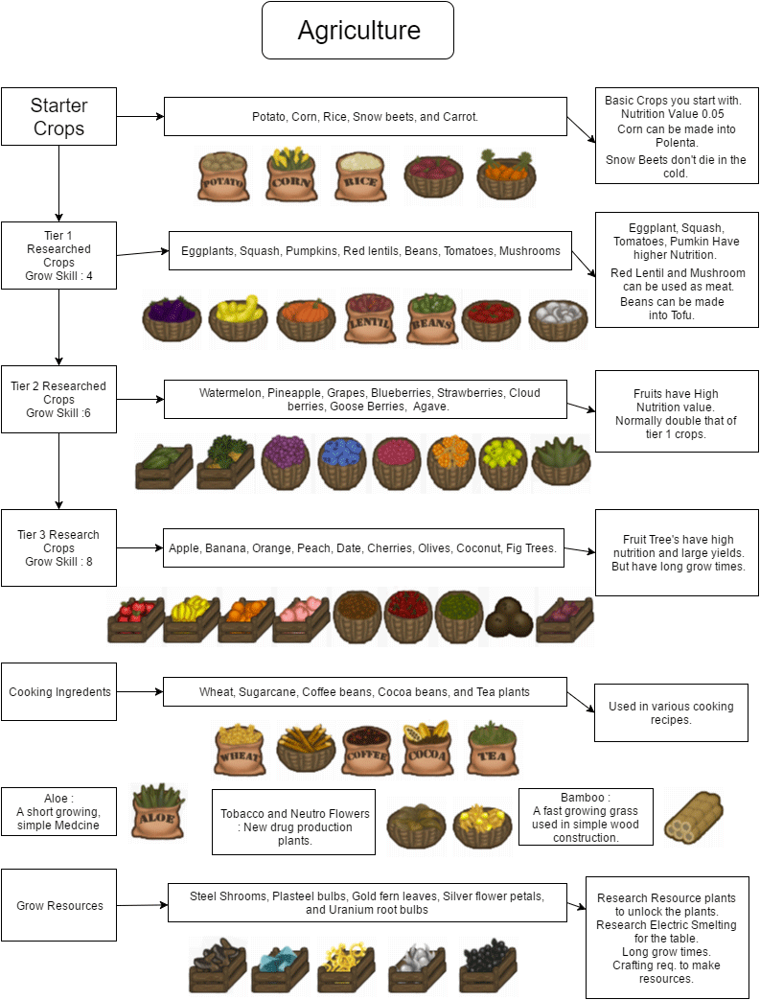
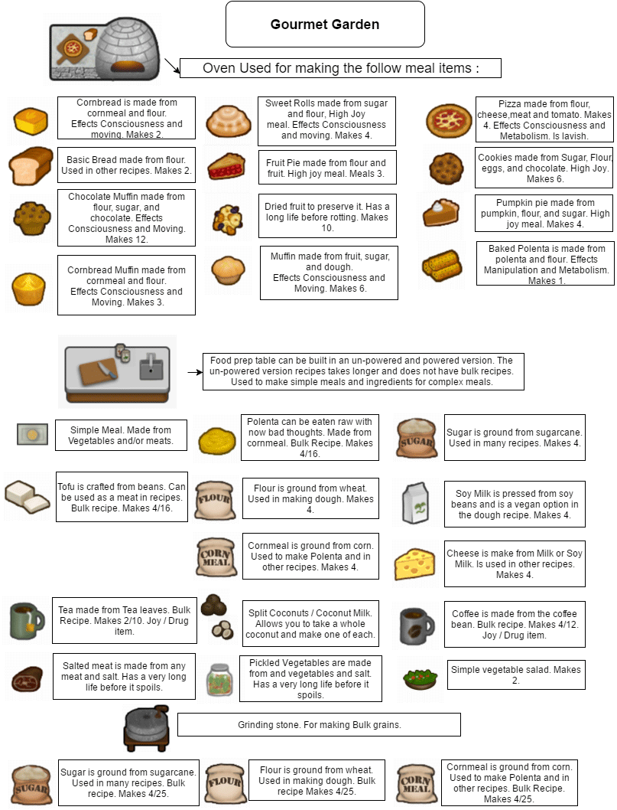
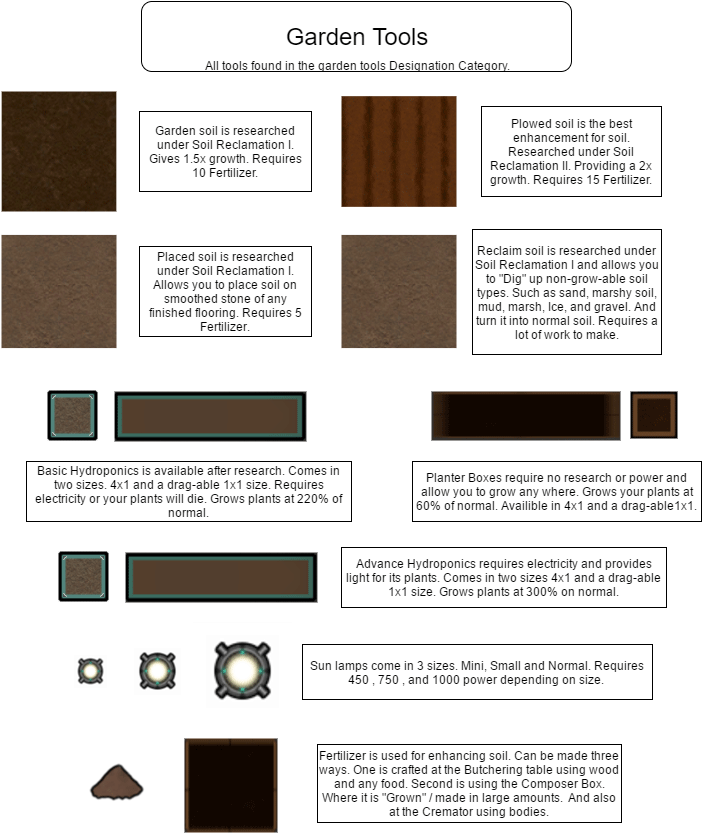
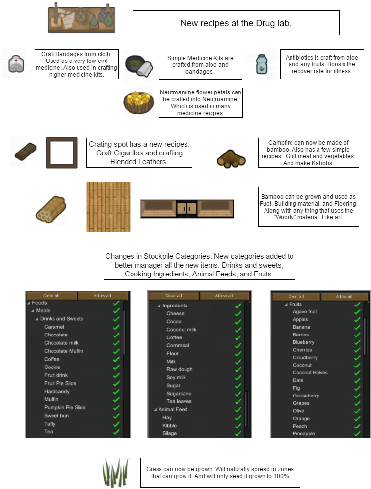
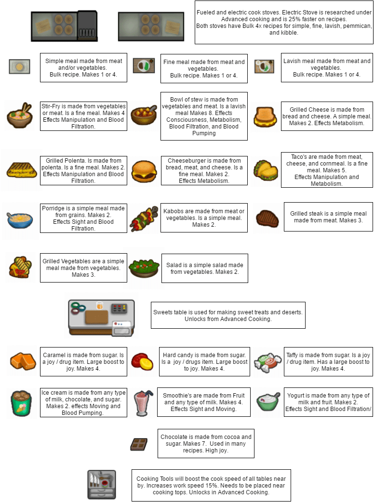

> 让边缘世界一秒变农场物语。

<!--more-->

# [dismar] Vegetable Garden 菜园子

## 模组信息

> 作者：dismar

> 翻译：deeprogger、风之起灵、Biscuit

> 原始发布页面：<a href="https://ludeon.com/forums/index.php?topic=12934.0"><i class="fa fa-link" aria-hidden="true" /> Ludeon 论坛</a>

> 适配游戏版本：<i class="fa fa-tag" aria-hidden="true"> 0.16.1393</i>

> 翻译内置进度：<i class="fa fa-exclamation-circle" aria-hidden="true" title="未内置，请从汉化组分流点下载" style="color:#b7aa00"> 未内置</i>

## 订阅与下载

> <a href="http://steamcommunity.com/sharedfiles/filedetails/?id=822470192"><i class="fa fa-steam-square" aria-hidden="true" /> Steam 创意工坊</a>

> <a href="https://www.dropbox.com/s/ck17go98jcp3z76/Vegetable%20Garden%205.3b.zip?dl=0"><i class="fa fa-dropbox" aria-hidden="true" /> Dropbox（作者原始下载）</a>

> <a href="http://pan.baidu.com/s/1eSaD9E6"><i class="fa fa-paw" aria-hidden="true" /> 百度云（汉化组分流点）</a>

## 模组简介

> <i class="fa fa-exclamation-triangle" aria-hidden="true" style="color:#a40000"> 注意：需要新建殖民地</i>

加入了大量的新农作物和食物、酒类，以及其他辅助建筑。

让边缘世界一秒变农场物语。

对原版内容的改动很大，比如「建筑规划」菜单里增加了「酿造」和「菜园」项，并且多种建筑在菜单中的命令被改动。

起灵吐槽：每次更新都加新内容，你考虑过汉化的感受吗？以前的贴图好丑，新版终于找到专业画师帮忙画了。

> <i class="fa fa-lightbulb-o" aria-hidden="true" style="color:#0075a9"> 提示</i>
种植棉花、恶魔菇不再直接产出布了，而是产出各种原材料，需要研究「恶魔菇」解锁「纺织机」，方能纺织成布;  
「肥料」在「屠宰台」制作;  
「炉灶（电力）」需要研究「VG：高级烹饪」。

  
  
  
  
  
  