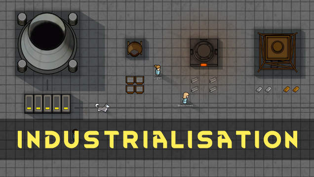

> 混凝土、高级钢、核电站

<!--more-->

# [eatKenny] Industrialisation 工业化

## 模组信息

> 作者：eatKenny
> 维护：duduluu

> 翻译：duduluu（风之起灵）

> 原始发布页面：<a href="https://ludeon.com/forums/index.php?topic=30547.0"><i class="fa fa-link" aria-hidden="true" /> Ludeon 论坛</a>

> 源代码：<a href="https://github.com/RimWorld-zh/eatKenny-Industrialisation" ><i class="fa fa-github" aria-hidden="true" /> GitHub</a>

> 许可协议：<a href="https://opensource.org/licenses/MIT" ><i class="fa fa-balance-scale" aria-hidden="true" /> MIT</a>

> 模组版本：<i class="fa fa-puzzle-piece" aria-hidden="true"> 0.16.0.1</i>

> 适配游戏版本：<i class="fa fa-tag" aria-hidden="true"> 0.16.1393</i>

> 翻译内置进度：<i class="fa fa-check-circle" aria-hidden="true" title="翻译已内置于原作者的模组中，可直接从Steam工坊订阅" style="color:#097c25"> 已内置</i>

## 订阅与下载

> <a href="http://steamcommunity.com/sharedfiles/filedetails/?id=863827593"><i class="fa fa-steam-square" aria-hidden="true" /> Steam-Workshop</a>
> <a href="https://github.com/RimWorld-zh/eatKenny-Industrialisation/releases" ><i class="fa fa-github" aria-hidden="true" /> GitHub Release</a>
> <a href="http://pan.baidu.com/s/1skKKBql"><i class="fa fa-paw" aria-hidden="true" /> 百度云</a>

## 模组简介

> <i class="fa fa-check-circle" aria-hidden="true" style="color:#097c25"> 不需要新建殖民地</i>
> <i class="fa fa-pencil" aria-hidden="true" style="color:#0075a9"> Mod 缩写为 Ind</i>

新材料: 
- 混凝土 
- 高级钢 
- 铜 
- 铝

新工作台:
- 混凝土搅拌机
- 电弧炉
- 深矿

新电力建筑: 
- 工业电缆
- 工业蓄电池
- 核电站

新贸易飞船:
- 深空矿业飞船

> <i class="fa fa-lightbulb-o" aria-hidden="true" style="color:#0075a9"> 提示</i>
想要建造「深矿」，你必须购买「天钻」来制造一个「深矿洞」。 
(天钻长得像一个对讲机，像手榴弹那样使用，攻击地面，然后等离子柱会制造一个深矿洞。)