> 殖民者编组功能、养蜂、战术计算机、探险、纳米复制仪、射击格斗训练设施、机器人、人工智能

<!--more-->

# [Haplo] Miscellaneous Misc系列模组

## 模组信息

> 作者：Haplo（代码）、mrofa（贴图）

> 翻译：风之起灵、Biscuit

> 原始发布页面：<a href="https://ludeon.com/forums/index.php?topic=3612.0"><i class="fa fa-link" aria-hidden="true" /> Ludeon 论坛</a>

> 源代码：请查看原始发布页面

> 许可协议：<a href="https://creativecommons.org/licenses/by-sa/4.0/" ><i class="fa fa-balance-scale" aria-hidden="true" /> CC BY-SA 4.0</a>

> 翻译内置进度：<i class="fa fa-check-circle" aria-hidden="true" title="翻译已内置于原作者的模组，可直接从Steam创意工坊订阅" style="color:#097c25"> 已内置</i>

## 订阅与下载

> <a href="http://steamcommunity.com/id/Haplo_X1/myworkshopfiles/?appid=294100&p=1&numperpage=30"><i class="fa fa-steam-square" aria-hidden="true" /> Steam-Workshop</a>

> <a href="http://www.nexusmods.com/rimworld/mods/36/?"><i class="fa fa-cloud-download" aria-hidden="true" /> Nexus Mods（作者原始下载）</a>

> <a href="http://pan.baidu.com/s/1i4LE6gt"><i class="fa fa-paw" aria-hidden="true" /> 百度云（汉化组分流点）</a>

> <i class="fa fa-exclamation-triangle" aria-hidden="true" style="color:#a40000"> 注意：Misc. Incidents 事件 暂未更新至A16</i>

## 模组简介

> <i class="fa fa-exclamation-triangle" aria-hidden="true" style="color:#a40000"> 注意：Misc系列模组由一个核心模组和多个子模组组成，部分子模组需要核心模组支持才能正常运行</i>

> <i class="fa fa-lightbulb-o" aria-hidden="true" style="color:#0075a9"> 提示</i>
Misc系列模组的研究项目均带有「Misc」前缀

---

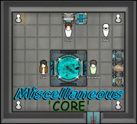
### Miscellaneous 'CORE' Misc. 核心

> 模组版本：<i class="fa fa-puzzle-piece" aria-hidden="true"> 0.16.4</i>
> 适配游戏版本：<i class="fa fa-tag" aria-hidden="true"> 0.16.1393</i>

> <i class="fa fa-check-circle" aria-hidden="true" style="color:#097c25"> 不需要新建殖民地</i>
> <i class="fa fa-exclamation-triangle" aria-hidden="true" style="color:#a40000"> 注意：这是Misc系列模组的核心模组，需要在其他子模组之前激活！</i>

**仿生大脑芯片**  
**电子大脑芯片**  
**轨道枪**  
（只能从商人处购买）  

**「殖民者编组」功能**  
按键6、7、8、9可用于定义编组和集合位置。  
征召你想定义编组和集合位置的殖民者，并命令他们到达目标位置。选中你想添加进编组的人，按下Shift+6（编入编组1）。  
你的征召的位置和选定的殖民者就被添加进编组了。  
按下数字键6即可将编组内的殖民者召集到预定位置。数字键6、7、8、9的用法相同。  

---

### Misc. Bees 'n' Honey Misc. 蜜蜂与蜂蜜

> 模组版本：<i class="fa fa-puzzle-piece" aria-hidden="true"> 0.16.5</i>
> 适配游戏版本：<i class="fa fa-tag" aria-hidden="true"> 0.16.1393</i>

> <i class="fa fa-check-circle" aria-hidden="true" style="color:#097c25"> 不需要新建殖民地</i>
> <i class="fa fa-lightbulb-o" aria-hidden="true" style="color:#0075a9"> 独立Mod，可单独安装</i>

**研究「Misc：养蜂」**  
**植物「空心树」**：野外随机出现，收获得到物品「蜂房（有蜂后）」，用于建造蜂箱。  
**物品「蜂房（有蜂后）」**：用于建造蜂箱，可在空心树上收获或通过蜂箱繁殖新的蜂后获得。  
**建筑「蜂箱」**：养蜂获得蜂蜜，需要在范围内有鲜花。  
**食物「蜂蜜」**  
**成瘾品「蜂蜜酒」**  

---

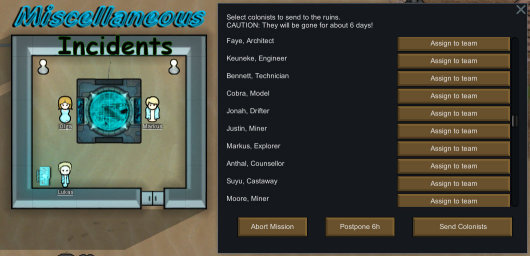
### Misc. Incidents Misc. 事件

> 模组版本：<i class="fa fa-puzzle-piece" aria-hidden="true"> 0.15.5</i>
> 适配游戏版本：<i class="fa fa-tag" aria-hidden="true"> 0.15.1284</i>

> <i class="fa fa-check-circle" aria-hidden="true" style="color:#097c25"> 不需要新建殖民地</i>
> <i class="fa fa-exclamation-triangle" aria-hidden="true" style="color:#a40000"> 注意：需要Misc.核心</i>

**建筑「战术计算机」**：有集合殖民者的功能，会触发事件「异常事件」。同时也是娱乐设施。  
**建筑「计算机终端」**：与战术计算机配合使用，召集殖民者。同时也是娱乐设施。  
**事件「人工制品」**：地图上随机出现。激活后有几率获得各种资源，也有几率引来敌人。  
**事件「坠毁的救生舱」**：类似原版「坠毁的逃生舱」。  
**事件「异常事件」**：由战术计算机触发，属于探险任务。可派遣殖民地前往调查。有几率获得高科技装备动力装甲、电荷步枪、「轨道枪」、大脑芯片等。也有几率引来敌人。  
**事件「传闻……」**：由访客触发，属于探险任务。可派遣殖民者前往。有几率获得一些武器、黄金或得到新成员。也有几率引来敌人。  

「注意」探险任务殖民者会离开地图数天！ 

---

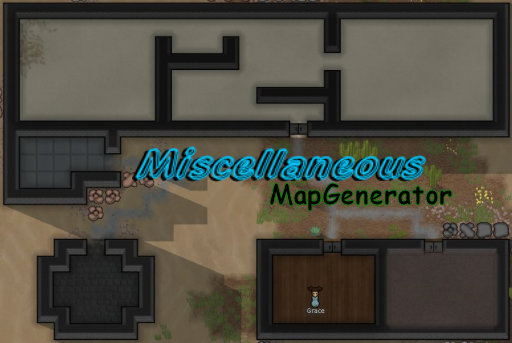
### Misc. MapGenerator Misc. 地图生成器

> 模组版本：<i class="fa fa-puzzle-piece" aria-hidden="true"> 0.16.6</i>
> 适配游戏版本：<i class="fa fa-tag" aria-hidden="true"> 0.16.1393</i>

> <i class="fa fa-exclamation-triangle" aria-hidden="true" style="color:#a40000"> 注意：需要新建殖民地</i>
> <i class="fa fa-exclamation-triangle" aria-hidden="true" style="color:#a40000"> 注意：需要Misc.核心</i>

地图生成类Mod，生成比原版地图建筑遗迹更复杂，更多样的建筑遗迹。

---

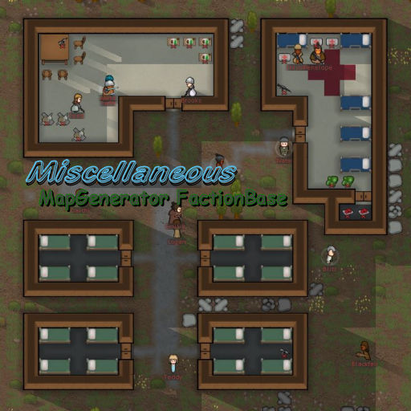
### Misc. MapGen FactionBase Misc. 地图生成器-派系基地

> 模组版本：<i class="fa fa-puzzle-piece" aria-hidden="true"> 0.16.6</i>
> 适配游戏版本：<i class="fa fa-tag" aria-hidden="true"> 0.16.1393</i>

> <i class="fa fa-check-circle" aria-hidden="true" style="color:#097c25"> 不需要新建殖民地</i>
> <i class="fa fa-lightbulb-o" aria-hidden="true" style="color:#0075a9"> 独立Mod，可单独安装</i>

派系基地的蓝图地图生成器。  
有时候会从可用蓝图中生成派系基地。  
为了避免重复，会基于蓝图数量来决定几率。  
交替形式继续使用原版的生成器。（原版几率85&-50%）。

你也可以通过Github贡献蓝图：[https://github.com/HaploX1/RimWorld-MapGenBaseBlueprints](https://github.com/HaploX1/RimWorld-MapGenBaseBlueprints)

---

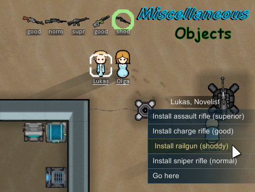
### Misc. Objects Misc. 武装

> 模组版本：<i class="fa fa-puzzle-piece" aria-hidden="true"> 0.16.2</i>
> 适配游戏版本：<i class="fa fa-tag" aria-hidden="true"> 0.16.1393</i>

> <i class="fa fa-check-circle" aria-hidden="true" style="color:#097c25"> 不需要新建殖民地</i>
> <i class="fa fa-exclamation-triangle" aria-hidden="true" style="color:#a40000"> 注意：需要Misc.核心</i>

**炮台「炮台基座」**：控制所安装武器的手动炮台。  
**炮台「自动炮台基座」**：能控制所安装武器的自动炮台。受损严重时会发生爆炸。智能通过购买获得。  
**计算机终端**：与战术计算机配合使用，召集殖民者。同时也是娱乐设施。  
**建筑「纳米打印机」、「纳米扫描仪」**：可以对武器进行复制。研究「Misc：纳米复制」后解锁建筑。注意：复制品的品质可能不是最好的。

---

### Misc. Training Facility Misc. 训练设施

> 模组版本：<i class="fa fa-puzzle-piece" aria-hidden="true"> 0.16.3</i>
> 适配游戏版本：<i class="fa fa-tag" aria-hidden="true"> 0.16.1393</i>

> <i class="fa fa-check-circle" aria-hidden="true" style="color:#097c25"> 不需要新建殖民地</i>
> <i class="fa fa-lightbulb-o" aria-hidden="true" style="color:#0075a9"> 独立Mod，可单独安装</i>

**「射击标靶」、「格斗假人」、「箭靶」**  
用于练习射击与格斗技能，射击标靶与格斗假人可强制命令进行练习，同时也是娱乐设施。箭靶单纯作为娱乐设施。

---

### Misc. Robot Misc. 机器人

> 模组版本：<i class="fa fa-puzzle-piece" aria-hidden="true"> 0.16.5</i>
> 适配游戏版本：<i class="fa fa-tag" aria-hidden="true"> 0.16.1393</i>

> <i class="fa fa-check-circle" aria-hidden="true" style="color:#097c25"> 不需要新建殖民地</i>
> <i class="fa fa-exclamation-triangle" aria-hidden="true" style="color:#a40000"> 注意：需要Misc.核心</i>

**专用机器人「搬运机」、「清洁机」**  
**新贸易商类型「机器人贸易商」**：出售以上两种专用机器人的基站，一个基站装备一个机器人。

---

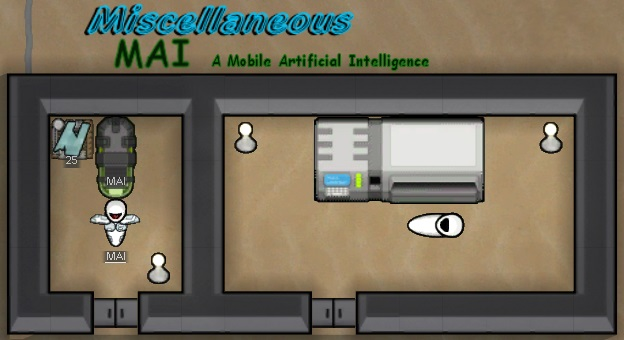
### Misc. MAI Misc. 人工智能

> 模组版本：<i class="fa fa-puzzle-piece" aria-hidden="true"> 0.16.2</i>
> 适配游戏版本：<i class="fa fa-tag" aria-hidden="true"> 0.16.1393</i>

> <i class="fa fa-check-circle" aria-hidden="true" style="color:#097c25"> 不需要新建殖民地</i>
> <i class="fa fa-exclamation-triangle" aria-hidden="true" style="color:#a40000"> 注意：需要Misc.核心</i>

旧翻译为智能机器人。  

**移动人工智能**：英文全称 Mobile Artificial Intelligence，缩写MAI。  
与人类相媲美的单位，可以代替你的殖民者从事所有工作（除了艺术）。  
 
使用方法：  
1. 完成 Misc.MAI 的研究
2. 建造「人工智能自动装配器」
3. 点击按钮「开始生成」（你需要指派一名**「搬运工作」**的殖民者往装配器搬运500钢铁和350白银）
4. 等待一小段时间后，生产出的人工智能会出现在装配器的出口
5. 将未激活的移动人工智能安装到某处，在清单中添加「激活人工智能」（可选择性别）

> <i class="fa fa-lightbulb-o" aria-hidden="true" style="color:#0075a9"> 提示</i>  
人工智能分为普通型和增强型两种  
普通型技能无学习兴趣度，升级速度缓慢  
增强型的人工智能的技能全部「双火」（兴趣度：狂热），升级很快，但需要消耗「AI角色核心」来激活

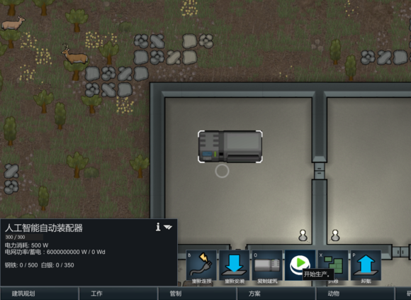
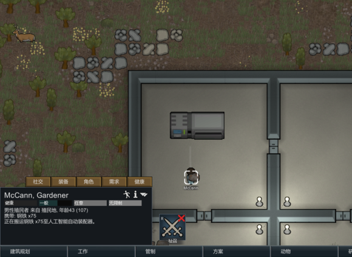
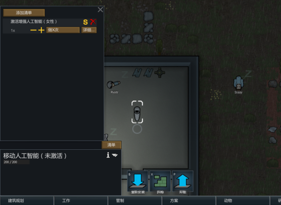
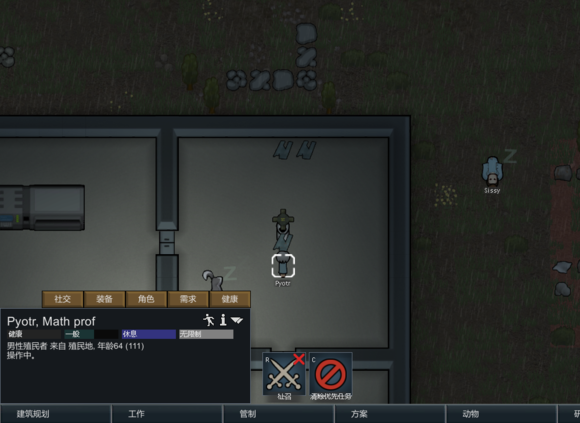
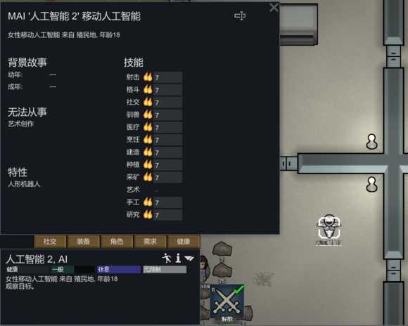

---

这是个伟大的模组，这个系列曾经的商队子模组和事件子模组，现在被官方吸收成为如今原版中的远行队。