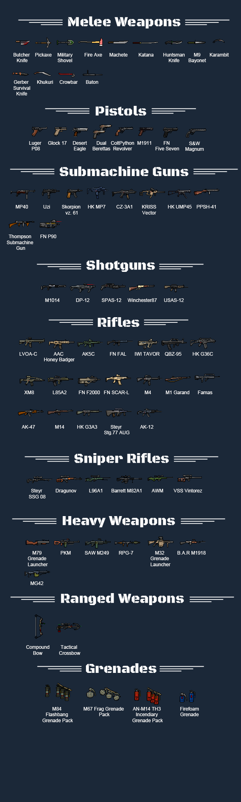

> Steam上最火的武器Mod。

<!--more-->

# [rhtstm] RT's Weapon Pack RT武器包

## 模组信息

> 作者：rhtstm

> 翻译：loli_nymph, 695983364（yuri/南地一闲人）

> 原始发布页面：<a href="https://ludeon.com/forums/index.php?topic=25272.0"><i class="fa fa-link" aria-hidden="true" /> Ludeon 论坛</a>

> 许可协议：<a href="" ><i class="fa fa-balance-scale" aria-hidden="true" /> 转载以及Mod包需注明出处；未经作者允许禁止将贴图用在他处。</a>

> 适配游戏版本：<i class="fa fa-tag" aria-hidden="true"> 0.16.1393</i>

> 翻译内置进度：<i class="fa fa-check-circle" aria-hidden="true" title="翻译已内置于原作者的模组中，可直接从Steam工坊订阅" style="color:#097c25"> 已内置</i>

## 订阅与下载

> <a href="http://steamcommunity.com/sharedfiles/filedetails/?id=730899625"><i class="fa fa-steam-square" aria-hidden="true" /> Steam-Workshop</a>
> <a href="https://drive.google.com/drive/folders/0B04zPa0iTuVkLVY5elRZMGFmUjg?usp=sharing"><i class="fa fa-google" aria-hidden="true" /> Google Drive（作者原始下载）</a>
> <a href="http://pan.baidu.com/s/1i5Pu2s1"><i class="fa fa-paw" aria-hidden="true" /> 百度云（作者原始下载）</a>

## 模组简介

> <i class="fa fa-check-circle" aria-hidden="true" style="color:#097c25"> 不需要新建殖民地</i>

注：此RT非彼RT。