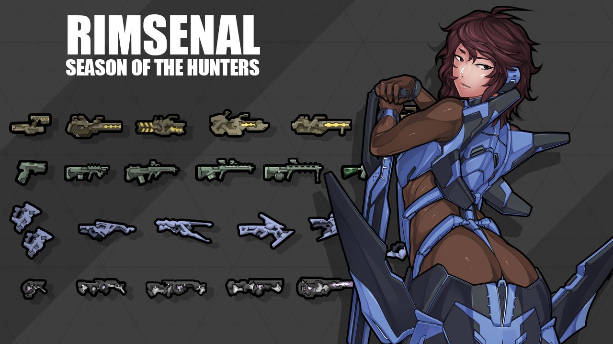
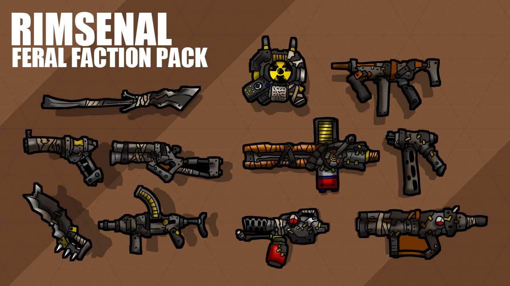
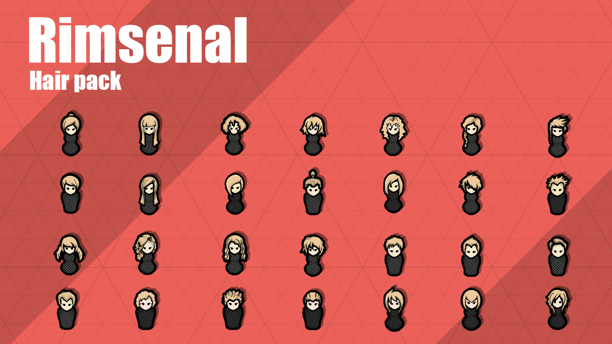
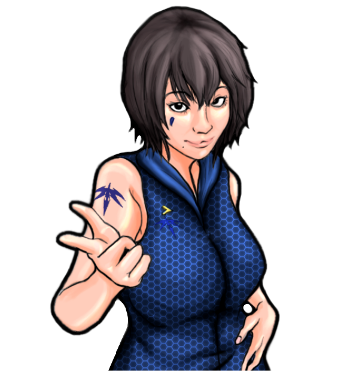

> 经典老牌模组系列：军工系列武器、联邦派系、蛮族派系、故事叙述者包、发型包、防卫包

<!--more-->

#  [rooki12k] Rimsenal 边缘军工

## 模组信息

> 作者：rooki12k

> 翻译：Biscuit、风之起灵

> 原始发布页面：<a href="https://ludeon.com/forums/index.php?topic=11160.0"><i class="fa fa-link" aria-hidden="true" /> Ludeon 论坛</a>

> 模组版本：<i class="fa fa-puzzle-piece" aria-hidden="true"> 0.861</i>

> 适配游戏版本：<i class="fa fa-tag" aria-hidden="true"> 0.16.1393</i>

> 翻译内置进度：<i class="fa fa-exclamation-circle" aria-hidden="true" title="未内置，请从汉化组分流点下载" style="color:#b7aa00"> 未内置</i>
<!--<i class="fa fa-check-circle" aria-hidden="true" title="翻译已内置于原作者的模组，可直接从Steam创意工坊订阅" style="color:#097c25"> 已内置</i>-->

## 订阅与下载

> <a href="http://steamcommunity.com/sharedfiles/filedetails/?id=725950793"><i class="fa fa-steam-square" aria-hidden="true" /> Steam-Workshop</a>

> <a href="http://pan.baidu.com/s/1dFonSLN"><i class="fa fa-paw" aria-hidden="true" /> 百度云（汉化组分流点）</a>

## 模组简介

> <i class="fa fa-exclamation-triangle" aria-hidden="true" style="color:#a40000"> 注意：增加派系需要新建殖民地</i>
> <i class="fa fa-exclamation-triangle" aria-hidden="true" style="color:#a40000"> 注意：边缘军工系列模组由1个核心模组和5个子模组组成，部分子模组需要核心模组支持才能正常运行</i>

> <i class="fa fa-lightbulb-o" aria-hidden="true" style="color:#0075a9"> 提示</i>
边缘军工系列模组的研究项目均带有「RS」前缀

---

## Rimsenal 边缘军工

> <i class="fa fa-lightbulb-o" aria-hidden="true" style="color:#0075a9"> 军工系列核心模组</i>

增加1个通用系列装备和4个军工系列装备。

### Common Item 通用物品

**碳连体服**：军队专属的碳晶体纤维连体服。轻而薄，强度极高。  
**战术背心**、**战术头盔**：符合人体工程学设计的护甲。能提升穿戴者的作战能力。  
**外骨骼**：外骨骼是一种便携机械，由电机、气动系统提供动力，贴合肢体运动的连杆和液压装置，以用于辅助提升穿戴着的力量耐力。  
**格斗护甲**：「精益」是一种内置护盾的动力装甲，具备机动性、耐久性和杀伤力的近身作战装备。  

**电荷手枪**、**电荷霰弹枪**、**电荷狙击枪**、**电荷加农炮**、**EMP步枪**

**炬剑**：「净化者」炬剑是一种带有握把和刀刃的大功率电浆炬。能点燃目标。

---

### Yunhwa Precision 允和高精

**神降护甲**：「允和高精」的「影然」空降服，为实现在世界范围内空投军队而投入生产。完全封闭的服装设计用于在极端环境下作战，比如宇宙真空。安装有增强穿戴着行动速度的推进器。
**神勇护甲**：「允和高精」的「镇川」神勇护甲。其「人工神经系统」通过神经连接使穿戴者的动作变得更为迅速。当然，更快并不意味着更准确。

**晶刺步枪**：「允和高精」的「冰霜」晶刺步枪具有优于传统步枪的精度，配备了更大的弹夹和更高的射速，但牺牲了威力和穿甲能力。
**晶炮**：「允和高精」的「朔风」晶炮，发射晶刺的高射速自动霰弹枪。是近距离处理活体目标的理想工具。
**狼牙步枪**：「允和高精」的「霜霾」狼牙步枪。有别于常规步枪，「霜霾」发射碳晶体穿甲弹。
**晶刺双枪**：「允和高精」的「雪华」双持手枪。「雪华」的射程很短，但近距离内可以撕碎敌人。
**微波发射器**：「允和高精」的「极光」微波发射器发射的毫米波能让目标皮肤水份沸腾的，产生无法忍受的痛苦。完美的人群控制武器。

**微波手榴弹**：「允和高精」的「白夜」微波手榴弹。这个小装置发射短暂的疼痛毫米波。一种惊人有效的人群控制武器。

**单手剑**：轻盈但极其尖锐，「冰锥」单手剑是「允和高精」私人武装的近战武器。

---

### Jotun Intersellar 巨人星际

**突击护甲**:「巨人星际」的突击护甲，以北欧神话中的「勇敢的比约恩」命名。用玻璃钢完全包裹住穿戴者，基本上就是一个人形自走坦克。

**熔火步枪**：「巨人星际」制造的「赤原猎犬」熔火步枪。这种武器使用融化的金属作为子弹。来自「贝武夫」的设计师从不关心使用者的感受，他们只关注纯粹的火力。
**熔火手枪**：「巨魔」熔火手枪是一款由「巨人星际」制造的重型手枪。发射熔融的金属流，「巨魔」的火力可以解决大多数孤立的殖民地的问题。
**攻城霰弹枪**：由「巨人星际」制造，以北欧神话巨龙「法夫尼尔」命名的巨大霰弹枪，简直就是把好几根高射炮管捆在一起。通常在城市战中对抗机械族。如果用攻城霰弹枪对着一个人来一发，他立马会变成血雾。
**反机甲步枪**：「巨人星际」制造的反机甲步枪，以奥丁的圣剑「格拉姆」命名。如同一辆小卡车般重，极难操作，那后坐力就像被驴踢了一脚。但它的威力证明了一切。
**攻城炮**：一场残酷的对机械族战争中的产物，以北欧神话中该隐一族后裔「格兰戴尔」命名，「巨人星际」制造的全银河系最强攻城武器。
**镇压者加农炮**：「巨人星际」制造的「火巨人」镇压炮，用于对付小型「爬虫」式机甲群。「火巨人」可连续发射超高热金属碎片。

**遥控炸药包**：「星际巨人」的「渣滓」遥控炸药包，战地工程师的最好伙伴。

**突击锤**：「神之祸根」是一种「巨人星际」制造的重型的大锤。

---

### Tisiphone Enterprise 底西福涅公司

**反射护甲**：一款为狩猎联邦残余而打造的动力装甲，以希腊神话中的复仇女神「涅墨西斯」命名。几乎免疫热能攻击，「底西福涅猎人特遣队」的精英猎人会装备这种护甲。

**动能步枪**：「底西福涅猎人特遣队」的现役步枪，代号「暴君」。为近身距离作战而设计，暴君最大的优点之一是它的切缘瞄准系统可以做到快速瞄准和追踪目标。
**动能手枪**：「底西福涅猎人特遣队」的制式手枪「折磨者」是一款射击迅速的个人防卫武器。
**轰击枪**：有别于其他普通的近身距离作战武器，「压迫者」霰弹枪发射带电动能弹筒。即使是远距离也同样致命。
**动能长程步枪**：为应对联邦狙击手进行快速反狙击而制造的最优良的狙击枪，「哀悼者」狙击步枪具有惊人的目标快速捕获能力。
**风暴加农炮**：「暴行」区域压制系统是为远距离压制复数目标而设计的。暴行极其优秀的机动性使其成为令人生畏的支援武器。
**动能标枪**：「耙地者」动能标枪能持续不断地发射集聚动能力场，「底西福涅猎人特遣队」为应对「联邦」的机甲而研发的武器。从字面上就能知道这是用来撕碎敌人的武器。

**冲击手榴弹**：「悲伤」冲击手榴弹爆炸时会释放冲击波。虽然伤害不高，但比常规手榴弹的覆盖范围更广。

**生存者刀**：「底西福涅猎人特遣队」的「生存者刀」。可以用于各种任务。

---

### Greydale Defence 灰谷防御

**先驱者护甲**：专为战地工程师设计的盔甲，「灰谷防御」的「拉科尼安」先驱者护甲集成了成套是工具包，非常适合穿着它在枪林弹雨中建造阵地。

**战术手枪**：「灰谷防御」的「猞猁」战术手枪。轻便易用，理想的个人防卫武器。使用小口径高速穿甲弹。
**模组化卡宾枪**：「灰谷防御」的「黑豹」模组化步枪系统，卡宾枪型。因其轻便和舒适性设计使其适合用于防卫任务。同时也是其他MRS的基础平台。\n\nMRS: Modular Rifle System 模组化卡步枪系统。
**模组化步枪**：「灰谷防御」的「黑豹」模组化步枪系统，步枪型。因其耐用和设计简单，在远程殖民地民兵中非常受欢迎。
**模组化DMR**：「灰谷防御」的「黑豹」模组化步枪系统，神射手步枪型。是精准火力支援或狩猎的极佳工具。
**模组化LMG**：「灰谷防御」的「黑豹」模组化步枪系统，轻机枪型。其持续不断的火力能给部队提供良好的支援。
**榴弹发射器**：由「灰谷防御」设计的「美洲豹」榴弹发射器，简单但高效的间接火力支援武器。
**高速衝鋒槍**：「灰谷防御」的「狞猫」高速轻型冲锋枪。为近距离作战设计，发射特制的小口径高速穿甲弹。

**迷你手榴弹**：「灰谷防御」的「山猫」迷你手榴弹。由于体积小，可以携带更多的数量。

**格斗刀**：「灰谷防御」的「剑齿虎」格斗刀，非常适合砍树或者砍下敌人的四肢。

> <i class="fa fa-lightbulb-o" aria-hidden="true" style="color:#0075a9"> 提示：MRS: Modular Rifle System 模组化步枪系统</i>
在机械加工台制作，需要对应的MRS转换套件，可逆向拆解：
* 模组化卡宾枪 + MRS-步枪转换套件 ↔ 模组化步枪  
* 模组化卡宾枪 + MRS-DMR转换套件 ↔ 模组化DMR  
* 模组化卡宾枪 + MRS-LMG转换套件 ↔ 模组化LMG  

---

## Rimsenal: Federation 边缘军工：联邦

> <i class="fa fa-exclamation-triangle" aria-hidden="true" style="color:#a40000"> 注意：子模组，需要核心模组支持</i>
> <i class="fa fa-exclamation-triangle" aria-hidden="true" style="color:#a40000"> 注意：经测试该派系单位战斗时会狂刷红字黄字，是否安装请自行斟酌</i>

过去银河系的中心有一个公正且强大的星际帝国，现在只被称为“联邦”。然而，漫长而残酷的与机械族的战争改变了一切。以“安全”为名践踏自由和公平。以“秩序”之名施以压迫和暴政。漫长的反联邦战争开始了。

内战爆发，一场前所未有的星际战争撕裂了联邦。现在联邦和它臭名昭著的维和部队只不过是一页历史。

然而，在与世隔绝的边缘世界，联邦之名与其走狗的意味完全不同。

新的派系：  
**联邦维和部队：Federation Peacekeeper Corps**

派系组成：  
人类：指挥官、奴隶兵、自杀炸弹、刺客  
生化人士兵：和平卫士、和平使者、和平教士  
大型生化机甲：联邦者  
小型侦查机甲：探索者  

新的军工：  
**武装动力：Arms Dynamics**

**联邦连体服**：为军事人员特制的碳晶纤维连体服。轻薄，但惊人地坚固。是联邦的军服。
**防暴服**：「武装动力」为联邦的人类指挥官制造的「判决者」防暴服。如果你不在意他人轻蔑的眼光，这绝对是顶级的个人装备。
**神射手服**：「动力武装」的「宣判者」神射手护甲。通过关节稳定装置，这套装备能保证瞄准时更稳定。「联邦和平使者」暗杀部队的标准制式护甲。

**熔炉步枪**：「动力武装」的「平定者」熔炉步枪，臭名昭著的联邦维和部队制式步枪。「平定者」能发射密集的能量子弹，蒸发一切。然而由于容易过热，射速较慢。
**熔炉手枪**：「动力武装」的「谈判者」熔炉手枪，使用一种被成为「能量熔炉」的非常规火力结构。「谈判者」的缺点是射速慢的令人抓狂。然而，威力和精度弥补了这一缺陷。
**熔炉加农炮**：「动力武装」的「仲裁者」熔炉加农炮。在联邦中「仲裁者」是收到严格管制的，因此这种灼烧能量武器仅装备给「联邦维和教士」——联邦维和部队中最强力成员。
**熔炉精密步枪**：作为「联邦和平使者」暗杀部队最青睐的武器，「动力武装」的「祈祷者」是一把远程能量武器。虽然「祈祷者」的单发威力略低于传统的狙击步枪，但他的高精度三连发子弹和更远的射程使其成为最可怕的武器。
**电浆投射器**：联邦最后一样武力，「公理」是提供给部队的武器中最臭名昭著的。「公理」发射的电浆球飞行非常缓慢，很容易躲过。然而一个「公理」一发就能摧毁整座建筑。

**电浆手榴弹**：「动力武装」的「寂静」电浆手雷。比传统手雷更有杀伤力，但爆炸半径略逊。

**冲击棍**：「联邦维和部队」的标准制式近战武器「裁决」冲击棍，看起来像是简单的非致命性武器，但实际上并非如此。

两种新炮塔：  
**收割者**：这种型号的激光脉冲炮被成为「收割者」。恰如其名，这种重型炮台可以瞬间收割成片的敌人。
**电浆轰击炮**：重型电浆轰击炮，速度慢但威力巨大。

---

## Rimsenal: Feral 边缘军工：蛮族

> <i class="fa fa-exclamation-triangle" aria-hidden="true" style="color:#a40000"> 注意：子模组，需要核心模组支持</i>

何为蛮族？想想那些生活在被毁灭文明的废墟中的野蛮人。他们不得不牺牲很多东西才能生存，科技、文化、历史、以及其中的所有，人性。他们是一群以劫掠和杀戮为生的野蛮人。虽然通常没有太强的武力，蛮族常常成群出动。对于你的殖民地，蛮族绝对是个大麻烦。

新的派系：  
**蛮族：Feral**

派系组成：  
人类：头目、骷髅破坏者、剥皮工、绞肉机、纵火狂、炸弹兵、火箭兵、分尸狂、潜伏者  
兽类：利齿兽  
变异人类：食人魔、扭曲怪

**蛮族双枪**：蛮族制作的拼凑而成的手枪。精度和射程较低，但威力和射速高于普通手枪。
**蛮族散铳**：拼凑的前装弹式短铳。致命，但射程极短、且装填时间长。
**蛮族突击步枪**：拼凑的突击步枪。高火力，短射程。
**蛮族鱼叉枪**：电动鱼叉枪。充电很慢，射程远，威力极大。
**蛮族冲锋枪**：粗糙拼凑的轻型冲锋枪。近距离很致命，并且有较高容量的弹夹。
**蛮族钉枪**：改装的重型钉枪。射速极高，但精度非常低，并且威力很小。
**蛮族火焰喷射器**：拼凑的火焰喷射器。
**蛮族火箭发射器**：拼凑的单发火箭发射器。
**蛮族爆炸鼠标枪**：绑着爆炸鼠的肿囊的标枪。
**蛮族骷髅破坏者**：用手摇驱动发射机构的自动重型武器。粗糙，但破坏性大。

**砍刀**：粗制滥造的砍刀。
**大刀**：粗制滥造的大刀。

**便携式核武器**：自制的便携式核聚变武器。用于边缘世界规模的互相保证毁灭战略。

Mutual Assured Destruction strategy：相互保证毁灭，是一种军事战略思想。是指对立的两方中如果有一方全面使用核武器则两方都会被毁灭。

---

## Rimsenal: Hair pack  边缘军工：发型包

> <i class="fa fa-check-circle" aria-hidden="true" style="color:#097c25"> 独立模组，可单独安装</i>

---

## Rimsenal: Storyteller pack  边缘军工：故事叙述者包

> <i class="fa fa-check-circle" aria-hidden="true" style="color:#097c25"> 独立模组，可单独安装</i>

**“朋友，派对时间已经结束了。是时候面对真实的故事了。”**  
苍鹰，允和高精新闻发言人，她对讲述故事有独到的见解。在早期，在你完全发展起来之前，苍鹰会对你的殖民地照顾有加。然后呢？她会无情地蹂躏你。赶紧行动，做好迎接审判的降临！

**“悲剧也有自己独特的魅力。请细细品味。”** 
宁静，暴戾的联邦维和部队指挥员，她有一大堆基于她之前工作类型的痛苦故事。在她的故事中，角色在无尽的痛苦挣扎后往往迎来死亡。她极爱这类故事。除了较少的袭击，她会引发大量折磨人的小事件。

**“只有一种方式能证明一个人的真正价值。那就是战火的考验。”**  
希尔德佳，一位从残酷的机械族战争中存活下来的老兵，巨人兵团的吟游诗人，她的歌声就像巨人王牌军团的人一样，充满了硝烟和战争。她会带来更多的“大威胁”而更少的事件。

---

## Rimsenal: Security pack  边缘军工：防卫包

> <i class="fa fa-exclamation-triangle" aria-hidden="true" style="color:#a40000"> 注意：子模组，需要核心模组支持</i>

**HMG阵地**：装备阵地用重机枪的固定式机枪阵地。简单而有效的防御建筑。
**AGS阵地**：装备自动榴弹发射器的固定式榴弹阵地。极为有效地迎击大量的敌人。
**MMG阵地**：三脚架上装备了固定式中型机枪。简单而有效的防御建筑。**可重新部署**。

**熔火加农炮**：驱动融化金属作为炮弹，性能可靠，熔岩加农炮是巨人兵团对抗机械族的主要重型武器。
**弹幕加农炮**：为远程火力支援而设计。发射集束火箭弹幕打击目标。

**冲击地雷**：具有运动追踪功能的先进地雷。检测到敌人时这种地雷会立即引爆。

**便携式反应堆**：小型的、便携式野外用反应堆，消耗铀来产生电力。当你需要电源时可以快速部署。损毁时会发生爆炸。

以后攻击海盗，带上这个就方便了。