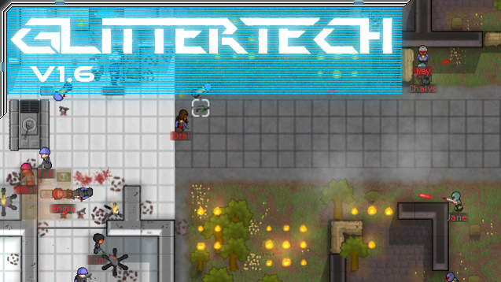
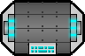
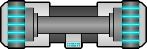
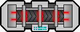

> 硬核向科幻模组！准备好被突击队蹂躏了吗？

<!--more-->

# [Sam] Glitter Tech 闪耀科技

## 模组信息

> 作者：Sam

> 翻译：风之起灵

> 原始发布页面：<a href="https://ludeon.com/forums/index.php?topic=5509.0"><i class="fa fa-link" aria-hidden="true" /> Ludeon 论坛</a>

> 源代码：<a href="https://github.com/sam23694/GlitterTech" ><i class="fa fa-github" aria-hidden="true" /> GitHub</a>

> 许可协议：转载需获得作者许可，并附带原始发布页面的链接

> 模组版本：<i class="fa fa-puzzle-piece" aria-hidden="true"> 1.65</i>

> 适配游戏版本：<i class="fa fa-tag" aria-hidden="true"> 0.16.1393</i>

> 翻译内置进度：<i class="fa fa-exclamation-circle" aria-hidden="true" title="翻译未内置，请从汉化组分流点下载" style="color:#b7aa00"> 未内置</i>
<!--<i class="fa fa-check-circle" aria-hidden="true" title="翻译已内置于原作者的模组中，可直接从Steam工坊订阅" style="color:#097c25"> 已内置</i>-->

## 订阅与下载

> <a href="http://steamcommunity.com/sharedfiles/filedetails/?id=725576127"><i class="fa fa-steam-square" aria-hidden="true" /> Steam-Workshop</a>
> <a href="https://github.com/sam23694/GlitterTech/releases" ><i class="fa fa-github" aria-hidden="true" /> GitHub（作者原始下载）</a>

> <a href="https://github.com/RimWorld-zh/GlitterTech/releases" ><i class="fa fa-github" aria-hidden="true" /> GitHub（汉化组分流点）</a>
> <a href="http://pan.baidu.com/s/1eSKal14"><i class="fa fa-paw" aria-hidden="true" /> 百度云（汉化组分流点）</a>

## 模组简介

> <i class="fa fa-exclamation-triangle" aria-hidden="true" style="color:#a40000"> 注意：需要新建殖民地</i>

> <i class="fa fa-pencil" aria-hidden="true" style="color:#0075a9"> Mod 缩写为 GT</i>

> <i class="fa fa-exclamation-triangle" aria-hidden="true" style="color:#a40000"> 兼容性警告！</i>
此模组兼容性较差，请尽量放置于其他模组之后激活。

---

### 新增建筑、武器、材料

#### 新增工作台：  

**配药桌**：制作「药物」、「闪耀世界药物」、「血浆」，需要研究**「GT：制药」**。  

**电解机**：「从岩石提取硅」、「从玻璃钢提取钛合金」、「从草莓提取乙醇」，需要研究**「GT：电解」**。  

**物质合成机**：「人工合成阿尔法纤维」、「人工合成贝塔纤维」、「制作玻璃钢」，需要研究**「GT：原子组装」**。  

**自动化装配机**：「装配电脑元件」、「装配电磁线圈」，需要研究**「GT：自动化工程」**。  

#### 新增材料：
**钛合金**  
**阿尔法纤维**  
**贝塔纤维**    
**硅**  
**电脑元件**  
**电磁线圈**
**乙醇**  
**绷带**  
**血清**  

> <i class="fa fa-lightbulb-o" aria-hidden="true" style="color:#0075a9"> 提示</i>
在前期，还无法建造自动化装配机的时候，可以在机械加工台生产「电脑元件」，配方名称为「从零部件中找寻电脑元件」，但花费较高。  

#### 新增家具：  
**修复舱**：为严重伤员而设计的医疗舱。通过将生物可降解的重构纳米机器人注入到血液中，在一段时间内可修复大多数伤，但有些伤扔需要一名医生。警告：这种医疗舱已调校为男性患者专用。（作者在简介中写男性专用，但实际上女性也能用。不过实测似乎不能自动治疗了，以前是可以的，不知道是不是出bug了）  
**动态休闲椅**：能动态重构形状的大型椅子，不仅能让仍何人舒适，还能感应到特定的不舒适的区域并提供温和或强力的按摩。就缺一个酒吧冰箱了……  
**泛光灯**：泛光灯能照亮一大片区域，但耗电更高。 
**墙（带窗）**  
**壁灯**   
**防爆门**  

#### 新增防御建筑：  
**防护板**：优秀的枪战掩体。  
**EMRG炮塔**：装载有EMRG（电磁轨道枪）步枪的哨戒炮组件，自动对附近的敌人开火。损毁时会发生爆炸。  
**速射霰弹炮塔**：威力强劲的速射霰弹炮塔，自动对附近的敌人开火。适合狭窄的室内，损毁时会发生爆炸。  
**自动迫击炮、自动集束迫击炮、自动EMP迫击炮、长程导弹炮塔、巡航导弹炮塔**

#### 新增贸易商：  
**黑市商人**  

#### 新增武器：  
**MRG-5手枪**：微型轨道枪5型。MRG-5步枪的组成部分，顶级线型轨道枪技术的第五代产品。非常精准且威力强大，和这种武器相比，火药武器看起来就像石器时代一样。  
**MRG-5步枪**：微型轨道枪5型。顶级线型轨道枪技术的第五代产品。非常精准且威力强大，和这种武器相比，火药武器看起来就像石器时代一样。  

> <i class="fa fa-lightbulb-o" aria-hidden="true" style="color:#0075a9"> 提示</i>
闪耀的武器和护甲均无法自行制作，只能购买。  
阿尔法纤维和贝塔纤维制作工作量极大，简易从商人处购买雕塑拆解。  

---

### 新增派系

#### Commando 突击队

**纳米服**：利用纳米技术增强的动力装甲，通常专供来自先进的闪耀世界行星的突击队。配备的电磁屏障能防护大部分动能武器的火力。  
**纳米头盔**：纳米服的集成头盔。配有闪亮的预警显示屏。内置最新的神经机械抗干扰程式（防护心灵波）。  
**反应式附甲**：动力反应式附甲。非常沉重，但能防护大量的武器火力。
**纤维紧身衣**：轻薄的纳米技术紧身衣。耐久不如完整的纳米服，但足够贴身，能穿在其他衣物之内，包括纳米服。这种护甲通常由高级的超级战士穿着，或者由高价值目标穿着来抵御刺杀。非常昂贵且稀有，但能提高穿著者的速度和防御能力。在装备了纳米服反应式装甲后，再在里层穿一件纤维紧身衣是最合适的。  
**高速紧身衣**：轻薄的纳米技术紧身衣。结构与碳纤维紧身衣结构相似，但以反应式金属液晶体编织而成，能同时大幅加强速度和机动。通过牺牲防御性能大幅提升速度。  

**APB-1手枪**：阴离子粒子束手枪1型。APB-1步枪的组成部分，这种手枪透过氢气发射阴离子，产生能在原子层面上湮灭物质的中性带电动能弹头。精准且威力强大，可点燃大多数目标。  
**APB-1粒子炮**：阴离子粒子束粒子炮1型。最新式的反空军与反坦克武器，这种粒子炮透过氢气发射阴离子，产生能在原子层面上湮灭物质的中性带电动能弹头。制造毁精准且威力强大的毁灭性的爆炸。  
**APB-1步枪**：阴离子粒子束步枪1型。最前沿的反人员武器，这种步枪透过氢气发射阴离子，产生能在原子层面上湮灭物质的中性带电动能弹头。精准且威力强大，可点燃大多数目标。  
**EMRG-1**：电磁轨道枪。最新式的远距离作战武器。威力极其强大。  

> <i class="fa fa-lightbulb-o" aria-hidden="true" style="color:#0075a9"> 提示</i>
Misc系列模组中也有个武器叫做「轨道枪」，不要和EMRG-1搞混淆了。

**高级仿生耳、高级仿生眼、高级仿生臂、高级仿生腿、高级仿生手、高级仿生足、高级仿生齿**  
**神经机械心、神经机械肺、神经机械肾、神经机械肝、神经机械胃**  

#### Orion Corporation 猎户座公司

*旧翻译为奥里恩公司*

**猎户座公司主战坦克**：这是传说中可以屠宰出坦克肉的玩意。 ←_← 武器是**「地狱火加农炮」**。  

**猎户座作战背心**：猎户座公司标准制式作战背心。相较于普通的防弹背心，添加了更先进的合金。  
**猎户座头盔**：猎户座公司标准制式头盔。标志性的经典星蓝色，相较于标准的军用头盔，使用更先进的合金制成。  
**猎户座制式长裤**  
**猎户座制式衬衫**  
**猎户座公司防护盾**：猎户座公司专利单人护盾。标准的能量上限，但护盾恢复速度远快于其他竞争对手。  

**OC防卫手枪**：猎户座公司系个人防卫武器。轻量级手枪，恶劣环境下完美的个人防卫装备。  
**OC防卫步枪**：猎户座公司系个人防卫武器。轻量级步枪，恶劣环境下完美的个人防卫装备。  
**OC火箭炮**：猎户座公司标准制式反坦克武器。具有激光瞄准，比普通火箭炮更精确。  
**猎户座平定匕首**：带有电极的匕首，用高热和电击冲击目标。目的在于以中等伤害造成最大的痛苦。  

**猎户座外骨骼**：猎户座公司标准制式外骨骼。这种外骨骼配备于大多数猎户座安全部队，给予他们微弱且足以胜任的优势以对抗竞争对手。
